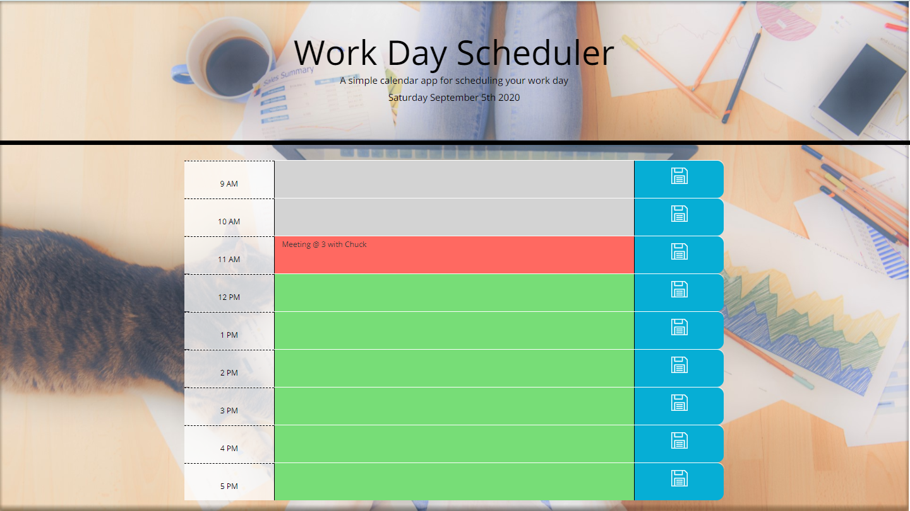

# Workday Scheduler

[Go To Site](https://daysloth.github.io/WorkDayScheduler/)

## Description 

This project was built as a simple 9-5 Workday planner. The planner will grab the system time using [Moment.js](https://momentjs.com) and update the colors for the text areas accordingly. Grey is past, Red is the current time and green is the future time. Moment.js is used for grabbing system time and to grab the current date and display that on the screen.

## Testing

Once you load the page it will pull local storage keys from a previous session. You can click a text area, type whatever you would like and then hit save. This will save it to local storage and refresh the page to display the correct time if it has changed.

## Unique Feature

If the user has been on the page and the time has changed since the initial load, I added a page refresh after they hit a save button to reload the page and display the correct color for the times.

## Credits

Credits go to W3 schools for clearing up any JavaScript questions I had

## License

Copyright (c) Allister Rampenthal. All rights reserved.

Licensed under the [MIT](https://choosealicense.com/licenses/mit/) license
